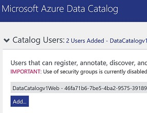

# Azure Data Catalog REST API Python Sample
Sample on how to use Azure Data Catalog from Python. A part for performing registration, searching and delete of resources it shows how to authenticate using AAD Web app/API without asking user to provide credentials.

To use the sample you have to:
1) Get your AAD Tenant ID
2) Configure an AAD Application Web app/API and get App ID and Secret
3) Give permission to the AAD Application to manage your Azure Data Catalog

## 1) Get your Azure Active Directory Tenant
Go to Azure portal http://portal.azure.com in the Azure Active Directory Blade, find the properties section and grab the **Directory ID**

## 2)Configure an AAD Application Web app/API
Go to Azure portal http://portal.azure.com in the Azure Active Directory Blade, find **App Registrations**, then press **+ New Application Registration**, give a name, select Web app/API, for sign-on url use https://login.live.com/oauth20_desktop.srf. Grab the **Application ID** because you will need it later. Press settings, then required permissions, add, 1 select API, and select Microsoft Azure Data Catalog, finaly press Select button. In the step 2 press select permissions, and select the radio button "Have full access to the Microsoft Azure Data Catalog" and press done. It takes a couple of seconds, now don't forget to press the "Grant Permission" button.
Back to the setting, go to Keys, under password give a description, expiring and press Save, now you will see the key that you need in the sample to autenticate.

## 3) Give permission to the AAD Application to manage your Azure Data Catalog
Go to your Microsoft Azure Data Catalog, press Settings in the top right corner. In the Catalog User section Add a new user in the format *ApplicationID@TenantID*, where the ApplicationID is the value you grab in step 2 and TenantID is the value you grab in step 1. Press Save. Eventually add the same user into the Glossary Administrators and Catalog Administrators groups based on the scenario and Data Catalog version you are working with.

